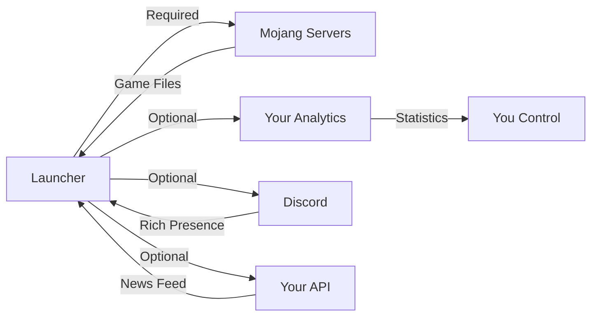

# 🔒 Privacy Policy / Gizlilik Politikası

**Last Updated / Son Güncelleme: October 2025**

[🇬🇧 English](#english) | [🇹🇷 Türkçe](#türkçe)

---

## English

### Overview

Blocksmiths Launcher (Public Version) is designed with **privacy-first principles**. We believe in transparency and user control over data.

### TL;DR (Too Long; Didn't Read)

✅ **NO personal data collection by default**  
✅ **NO tracking or analytics without your consent**  
✅ **ALL data stored locally on your device**  
✅ **NO cloud sync or remote storage**  
✅ **Open source - you can verify everything**

### Data Storage

#### What We Store Locally

All data is stored on **YOUR device only**:

| Data Type | File Location | Purpose | Sent Anywhere? |
|-----------|---------------|---------|----------------|
| **Player Profiles** | `%APPDATA%/blocksmiths-launcher/profiles.json` | Store your player names and settings | ❌ Never |
| **Game Settings** | `%APPDATA%/blocksmiths-launcher/settings.json` | Memory, Java path, window size | ❌ Never |
| **Minecraft Files** | `~/.blocksmiths/minecraft/` | Game assets, libraries, versions | ❌ Never |
| **Cache** | `~/.blocksmiths/cache/` | Speed up subsequent launches | ❌ Never |
| **Logs** | `~/.blocksmiths/logs/` | Debugging information | ❌ Never |

> **Note**: You can delete these files anytime. The launcher will recreate defaults.

### Network Connections

#### Required Connections

| Service | When | What's Sent | Why |
|---------|------|-------------|-----|
| **Mojang Servers** | On game launch | Minecraft version ID | Download game files |
| `https://launchermeta.mojang.com` | First launch of a version | Version manifest request | Get file list |
| `https://resources.download.minecraft.net` | Missing assets | Asset hash | Download textures, sounds |
| `https://libraries.minecraft.net` | Missing libraries | Library name | Download game libraries |

**What we DON'T send to Mojang:**
- ❌ Your profile name
- ❌ Your computer name
- ❌ Your IP address (they see it, but we don't send it)
- ❌ Any personal information

#### Optional Connections (User-Configured)

| Service | Enabled By | What's Sent | Can Disable? |
|---------|------------|-------------|--------------|
| **Discord RPC** | If Discord app is running | Game name, version, playtime | ✅ Yes (toggle in settings) |
| **News Feed** | If `API_URL` is set | HTTP GET request only | ✅ Yes (leave env var empty) |
| **Analytics** | If `ANALYTICS_KEY` is set | Launcher version, OS type | ✅ Yes (don't set the key) |

### API Keys & Credentials

**ALL API keys are user-provided. We don't include any hardcoded keys.**

#### How to Verify

1. **Search the codebase:**
   ```bash
   # Search for any hardcoded keys
   grep -r "AIzaSy\|sk_live\|pk_live\|xoxb" src/
   
   # Result: Should be EMPTY (no matches)
   ```

2. **Check environment variables:**
   ```bash
   # See what env vars are used
   grep -r "process.env" src/
   
   # You'll see:
   # - ANALYTICS_KEY (optional, you provide)
   # - API_URL (optional, you provide)
   # - DISCORD_CLIENT_ID (optional, you provide)
   ```

3. **Inspect network requests:**
   ```bash
   # See all HTTP/HTTPS calls
   grep -r "fetch\|axios\|request" src/
   
   # Verify destinations are only:
   # - Mojang servers (minecraft.net)
   # - Your own configured API_URL
   # - Discord (if enabled)
   ```

#### Where to Get Keys

| Key | Where to Get It | Required? |
|-----|-----------------|-----------|
| `ANALYTICS_KEY` | Create your own (Google Analytics, Plausible, etc.) | ❌ No |
| `API_URL` | Your own backend server | ❌ No |
| `DISCORD_CLIENT_ID` | [Discord Developer Portal](https://discord.com/developers/applications) | ❌ No |

**The launcher works 100% without any of these keys.**

### Third-Party Services

#### What Connects Where



#### Service Details

**Mojang Servers** (Required)
- **What**: Minecraft game files
- **When**: On launch/update
- **Data Sent**: Version ID only
- **Privacy Policy**: [Mojang Privacy Policy](https://www.minecraft.net/privacy)

**Discord** (Optional)
- **What**: Rich Presence (show what you're playing)
- **When**: If Discord app is running
- **Data Sent**: Game name, version, timestamp
- **Privacy Policy**: [Discord Privacy Policy](https://discord.com/privacy)

**Your Own Services** (Optional)
- **Analytics/API**: YOU control what's collected
- **Privacy Policy**: YOU write it
- **Data**: YOU decide what to send

### Browser Data / Local Storage

**The launcher does NOT use:**
- ❌ Cookies
- ❌ Browser local storage (this is an Electron app, not a web app)
- ❌ IndexedDB
- ❌ Web SQL
- ❌ Session storage

**We use:**
- ✅ Plain JSON files (see table above)
- ✅ All stored in user's application data folder
- ✅ No encryption (nothing sensitive stored)
- ✅ Human-readable format (you can open and read them)

### Data You Can Delete

**To completely remove all data:**

1. **Uninstall the launcher**
2. **Delete data folders:**
   - Windows: `C:\Users\YourName\AppData\Roaming\blocksmiths-launcher`
   - macOS: `~/Library/Application Support/blocksmiths-launcher`
   - Linux: `~/.config/blocksmiths-launcher`
3. **Delete game files** (optional):
   - `~/.blocksmiths/minecraft/`

### Children's Privacy

This launcher does **NOT knowingly collect data from children**. 

- No data collection by default
- No accounts or registration required
- Parental control recommended (set RAM limits, disable Discord RPC)

### Your Rights

Under GDPR/CCPA, you have the right to:
- ✅ **Access** - View all data (it's in JSON files on your PC)
- ✅ **Delete** - Delete folders mentioned above
- ✅ **Portability** - Copy JSON files anywhere
- ✅ **Object** - Don't set API keys to disable optional features

**We can't violate your rights because we don't have your data in the first place.**

### Security

**What we do:**
- ✅ SHA1 verification of all downloads
- ✅ HTTPS-only connections
- ✅ No password storage (offline authentication only)
- ✅ Open source (security by transparency)

**What we don't do:**
- ❌ Store credit cards (not applicable)
- ❌ Store passwords (not applicable)
- ❌ Send data to third parties (without your config)

### Changes to Privacy Policy

If we update this policy:
- 📝 Updated in this file
- 📢 Announced on GitHub releases
- 📧 Optionally emailed (if you subscribed to newsletter)

### Contact

Questions about privacy?
- 📧 Email: privacy@blocksmithslauncher.com
- 🐛 GitHub Issues: [Report Privacy Concern](https://github.com/blocksmiths/launcher-public/issues)

---

## Türkçe

### Genel Bakış

Blocksmiths Launcher (Açık Kaynak Versiyon) **gizlilik öncelikli ilkelerle** tasarlanmıştır. Şeffaflığa ve kullanıcı kontrolüne inanıyoruz.

### Özet

✅ **Varsayılan olarak KİŞİSEL veri toplama YOK**  
✅ **İzniniz olmadan izleme veya analitik YOK**  
✅ **TÜM veriler cihazınızda yerel olarak saklanır**  
✅ **Bulut senkronizasyonu veya uzak depolama YOK**  
✅ **Açık kaynak - her şeyi doğrulayabilirsiniz**

### Veri Depolama

#### Yerel Olarak Sakladıklarımız

Tüm veriler **SADECE SİZİN cihazınızda** saklanır:

| Veri Tipi | Dosya Konumu | Amaç | Bir Yere Gönderiliyor mu? |
|-----------|--------------|------|---------------------------|
| **Oyuncu Profilleri** | `%APPDATA%/blocksmiths-launcher/profiles.json` | Oyuncu isimlerini ve ayarlarını sakla | ❌ Asla |
| **Oyun Ayarları** | `%APPDATA%/blocksmiths-launcher/settings.json` | Bellek, Java yolu, pencere boyutu | ❌ Asla |
| **Minecraft Dosyaları** | `~/.blocksmiths/minecraft/` | Oyun varlıkları, kütüphaneler, versiyonlar | ❌ Asla |
| **Önbellek** | `~/.blocksmiths/cache/` | Sonraki başlatmaları hızlandır | ❌ Asla |
| **Loglar** | `~/.blocksmiths/logs/` | Hata ayıklama bilgisi | ❌ Asla |

> **Not**: Bu dosyaları istediğiniz zaman silebilirsiniz. Launcher varsayılanları yeniden oluşturur.

### Ağ Bağlantıları

#### Gerekli Bağlantılar

| Servis | Ne Zaman | Ne Gönderilir | Neden |
|--------|----------|---------------|-------|
| **Mojang Sunucuları** | Oyun başlatmada | Minecraft versiyon ID | Oyun dosyalarını indir |
| `https://launchermeta.mojang.com` | Bir versiyonun ilk başlatılması | Versiyon manifest isteği | Dosya listesini al |
| `https://resources.download.minecraft.net` | Eksik varlıklar | Varlık hash'i | Dokuları, sesleri indir |
| `https://libraries.minecraft.net` | Eksik kütüphaneler | Kütüphane adı | Oyun kütüphanelerini indir |

**Mojang'a GÖNDERMEDİĞİMİZ şeyler:**
- ❌ Profil adınız
- ❌ Bilgisayar adınız
- ❌ IP adresiniz (onlar görür ama biz göndermiyoruz)
- ❌ Herhangi bir kişisel bilgi

#### İsteğe Bağlı Bağlantılar (Kullanıcı Yapılandırmalı)

| Servis | Nasıl Etkinleşir | Ne Gönderilir | Devre Dışı Bırakılabilir mi? |
|--------|------------------|---------------|------------------------------|
| **Discord RPC** | Discord uygulaması çalışıyorsa | Oyun adı, versiyon, süre | ✅ Evet (ayarlarda kapat) |
| **Haber Akışı** | `API_URL` ayarlıysa | Sadece HTTP GET isteği | ✅ Evet (env var'ı boş bırak) |
| **Analytics** | `ANALYTICS_KEY` ayarlıysa | Launcher versiyonu, OS tipi | ✅ Evet (anahtarı ayarlama) |

### API Anahtarları & Kimlik Bilgileri

**TÜM API anahtarları kullanıcı tarafından sağlanır. Sabit kodlanmış anahtar YOK.**

#### Nasıl Doğrulanır

1. **Kod tabanını arayın:**
   ```bash
   # Sabit kodlanmış anahtarları ara
   grep -r "AIzaSy\|sk_live\|pk_live\|xoxb" src/
   
   # Sonuç: BOŞ olmalı (eşleşme yok)
   ```

2. **Ortam değişkenlerini kontrol edin:**
   ```bash
   # Hangi env var'ların kullanıldığını gör
   grep -r "process.env" src/
   
   # Göreceksiniz:
   # - ANALYTICS_KEY (isteğe bağlı, siz sağlarsınız)
   # - API_URL (isteğe bağlı, siz sağlarsınız)
   # - DISCORD_CLIENT_ID (isteğe bağlı, siz sağlarsınız)
   ```

3. **Ağ isteklerini inceleyin:**
   ```bash
   # Tüm HTTP/HTTPS çağrılarını gör
   grep -r "fetch\|axios\|request" src/
   
   # Hedeflerin sadece bunlar olduğunu doğrulayın:
   # - Mojang sunucuları (minecraft.net)
   # - Sizin yapılandırdığınız API_URL
   # - Discord (etkinse)
   ```

#### Anahtarlar Nereden Alınır

| Anahtar | Nereden Alınır | Gerekli mi? |
|---------|----------------|-------------|
| `ANALYTICS_KEY` | Kendiniz oluşturun (Google Analytics, Plausible vb.) | ❌ Hayır |
| `API_URL` | Kendi backend sunucunuz | ❌ Hayır |
| `DISCORD_CLIENT_ID` | [Discord Developer Portal](https://discord.com/developers/applications) | ❌ Hayır |

**Launcher bu anahtarların hiçbiri olmadan %100 çalışır.**

### Tarayıcı Verisi / Yerel Depolama

**Launcher KULLANMAZ:**
- ❌ Çerezler (Cookies)
- ❌ Tarayıcı yerel depolaması (bu bir Electron uygulaması, web uygulaması değil)
- ❌ IndexedDB
- ❌ Web SQL
- ❌ Session storage

**KULLANIRIZ:**
- ✅ Düz JSON dosyaları (yukarıdaki tabloya bakın)
- ✅ Hepsi kullanıcının uygulama veri klasöründe
- ✅ Şifreleme yok (hassas bir şey saklanmıyor)
- ✅ İnsan tarafından okunabilir format (açıp okuyabilirsiniz)

### Silebileceğiniz Veriler

**Tüm verileri tamamen kaldırmak için:**

1. **Launcher'ı kaldırın**
2. **Veri klasörlerini silin:**
   - Windows: `C:\Users\KullaniciAdiniz\AppData\Roaming\blocksmiths-launcher`
   - macOS: `~/Library/Application Support/blocksmiths-launcher`
   - Linux: `~/.config/blocksmiths-launcher`
3. **Oyun dosyalarını silin** (isteğe bağlı):
   - `~/.blocksmiths/minecraft/`

### Çocukların Gizliliği

Bu launcher **çocuklardan bilerek veri toplamaz**.

- Varsayılan olarak veri toplama yok
- Hesap veya kayıt gerekmiyor
- Ebeveyn kontrolü önerilir (RAM limiti ayarlayın, Discord RPC'yi kapatın)

### Haklarınız

KVKK/GDPR altında haklarınız:
- ✅ **Erişim** - Tüm verileri görüntüle (PC'nizdeki JSON dosyalarında)
- ✅ **Silme** - Yukarıda bahsedilen klasörleri sil
- ✅ **Taşınabilirlik** - JSON dosyalarını istediğiniz yere kopyala
- ✅ **İtiraz** - İsteğe bağlı özellikleri devre dışı bırakmak için API anahtarlarını ayarlama

**Haklarınızı ihlal edemeyiz çünkü zaten verilerinize sahip değiliz.**

### Güvenlik

**Yaptıklarımız:**
- ✅ Tüm indirmelerin SHA1 doğrulaması
- ✅ Sadece HTTPS bağlantıları
- ✅ Şifre saklama yok (sadece çevrimdışı kimlik doğrulama)
- ✅ Açık kaynak (şeffaflıkla güvenlik)

**Yapmadıklarımız:**
- ❌ Kredi kartı saklama (uygulanabilir değil)
- ❌ Şifre saklama (uygulanabilir değil)
- ❌ Üçüncü taraflara veri gönderme (yapılandırmanız olmadan)

### Gizlilik Politikası Değişiklikleri

Bu politikayı güncellersek:
- 📝 Bu dosyada güncellenir
- 📢 GitHub sürümlerinde duyurulur
- 📧 İsteğe bağlı olarak e-posta gönderilir (bültene abone olduysanız)

### İletişim

Gizlilik hakkında sorular?
- 📧 Email: privacy@blocksmithslauncher.com
- 🐛 GitHub Issues: [Gizlilik Endişesi Bildir](https://github.com/blocksmiths/launcher-public/issues)

---

<div align="center">

**Your Privacy is Our Priority / Gizliliğiniz Önceliğimizdir**

Made with ❤️ by Blocksmiths Team

</div>

